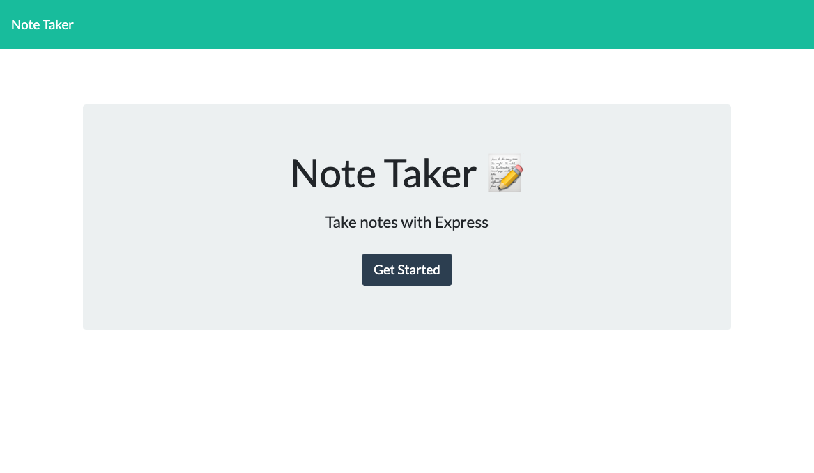
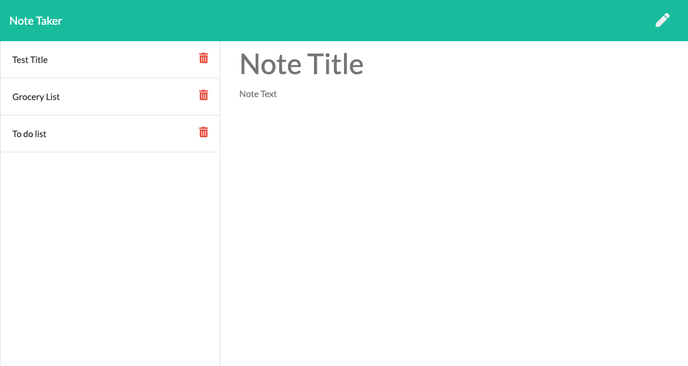

# note-taker

## Description
This is a note-taking application that can be used to write and save notes. This application will use an Express.js back end and will save and retrieve note data from a JSON file.

### Functional Elements:

* When the user opens the application landing page, there is a link they can click that leads to the notes page.
* When the notes page link is clicked, the user is presented with a page with existing notes listed in the left-hand column, plus empty fields to enter a new note title and the note’s text in the right-hand column
* The user enters a new note title and the note’s text, a Save icon appears in the navigation at the top of the page
* When the user clicks on the Save icon, the new note they have entered is saved and appears in the left-hand column with the other existing notes
* When the user clicks on an existing note in the list in the left-hand column, that note appears in the right-hand column
* When the user clicks on the Write icon in the navigation at the top of the page, they are presented with empty fields to enter a new note title and the note’s text in the right-hand column

### Issues
* Delete button is not yet functioning because delete route has not been added
* It appears notes cannot be edited after saving

## Usage
This application is delpyed through Heroku at the following link: https://guarded-caverns-55464.herokuapp.com/

The page has the following appearance: 

## Technologies Used

* Node.js: https://nodejs.org/en/
* Inquirer npm: https://www.npmjs.com/package/inquirer
* uuid npm: https://www.npmjs.com/package/uuid 
* fs npm: https://www.npmjs.com/package/file-system 

## License

MIT License

Copyright (c) [2021] [Sue Jin Kim]

Permission is hereby granted, free of charge, to any person obtaining a copy of this software and associated documentation files (the "Software"), to deal in the Software without restriction, including without limitation the rights to use, copy, modify, merge, publish, distribute, sublicense, and/or sell copies of the Software, and to permit persons to whom the Software is furnished to do so, subject to the following conditions:

The above copyright notice and this permission notice shall be included in all copies or substantial portions of the Software.

THE SOFTWARE IS PROVIDED "AS IS", WITHOUT WARRANTY OF ANY KIND, EXPRESS OR IMPLIED, INCLUDING BUT NOT LIMITED TO THE WARRANTIES OF MERCHANTABILITY, FITNESS FOR A PARTICULAR PURPOSE AND NONINFRINGEMENT. IN NO EVENT SHALL THE AUTHORS OR COPYRIGHT HOLDERS BE LIABLE FOR ANY CLAIM, DAMAGES OR OTHER LIABILITY, WHETHER IN AN ACTION OF CONTRACT, TORT OR OTHERWISE, ARISING FROM, OUT OF OR IN CONNECTION WITH THE SOFTWARE OR THE USE OR OTHER DEALINGS IN THE SOFTWARE.